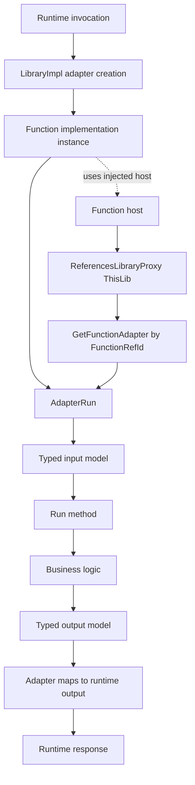

# Function Host, Proxies, and Adapters (src)

This document explains how function execution is wired in this project, focused on the classes in the `src` folder.

## High-level architecture

The runtime flow is:

1. A function is requested by `LibraryImpl`.
2. `LibraryImpl` creates the correct function implementation (for example, `DownloadAssembliesImpl`).
3. The function implementation receives `IFunctionHost` through the base `Function<TInput, TOutput>` class.
4. Adapter methods (`AdapterRun`) convert raw runtime inputs into typed input objects and convert typed outputs back to tuples/object arrays.
5. A proxy (`ReferencesLibraryProxy`) can call functions in the same library through the host using a `FunctionRefId`.

## Mermaid diagram

## Function host responsibilities

### Where it appears
- `function.base.cs`
- `library.impl.cs`
- `proxies.@this.lib.cs`

### What it does
- `IFunctionHost` is the runtime context used to execute functions and obtain adapters.
- In `Function<TInput, TOutput>`, the host is injected into the constructor and passed to the Epicor base class.
- The same host is used to lazily build `ThisLib` (`ReferencesLibraryProxy`) so functions can call other library functions safely through runtime plumbing.
- In `LibraryImpl`, the host is used when creating function adapters via delegates.

## Adapter responsibilities

### Where they appear
- `DownloadAssemblies.adapter.cs`
- `GetAvailableReferences.adapter.cs`
- registration in `library.impl.cs`

### What they do
- Adapters are the boundary between generic runtime invocation and typed function code.
- They validate input arity (`SignatureGuard.NumberOfItems` where needed).
- They map incoming tuple/object[] payloads into typed input models:
  - `DownloadAssembliesInput`
  - `FunctionInput` (for no-argument function)
- They call `Run(functionInput)` and map typed result objects back to tuple/object[] output.

This keeps transport/runtime concerns out of the core function logic in `DownloadAssemblies.cs` and `GetAvailableReferences.cs`.

## Proxy responsibilities

### Where it appears
- `proxies.@this.lib.cs`
- exposed through `ThisLib` in `function.base.cs`

### What it does
- `ReferencesLibraryProxy` is a typed in-library client.
- Each method builds a `FunctionRefId` using:
  - library id: `References`
  - function id: target function name
- It requests an adapter from the host (`host.GetFunctionAdapter(functionRefId)`), executes it, and casts positional return values into strongly-typed tuples.

This provides a clean, typed call surface for one function to call another function in the same library.

## Wiring and registration

In `library.impl.cs`, `LibraryImpl` registers two maps:

- `adapters`: maps `FunctionId` -> factory `(IFunctionHost) => IFunctionAdapter`
- `restAdapters`: maps `FunctionId` -> `IFunctionRestAdapter`

Current registered functions:

- `DownloadAssemblies`
- `GetAvailableReferences`

If a function id is not present, `CreateAdapter` / `CreateRestAdapter` returns `null`.

## End-to-end example: DownloadAssemblies

1. Runtime requests `DownloadAssemblies`.
2. `LibraryImpl.CreateAdapter` resolves factory and builds `DownloadAssembliesImpl(host)`.
3. `DownloadAssembliesImpl.AdapterRun` converts runtime input into `DownloadAssembliesInput`.
4. `Run(functionInput)` executes custom logic in `DownloadAssemblies.cs`.
5. Adapter returns standardized positional outputs (`Success`, `Message`, `ZipBase64`).

## Why this separation matters

- Host: runtime execution context and adapter access.
- Adapters: protocol/shape translation between runtime and typed domain models.
- Proxy: internal typed invocation surface for cross-function calls.
- Function logic files: business logic only.

Together, this keeps concerns separated and makes runtime integration predictable while preserving readable function logic.